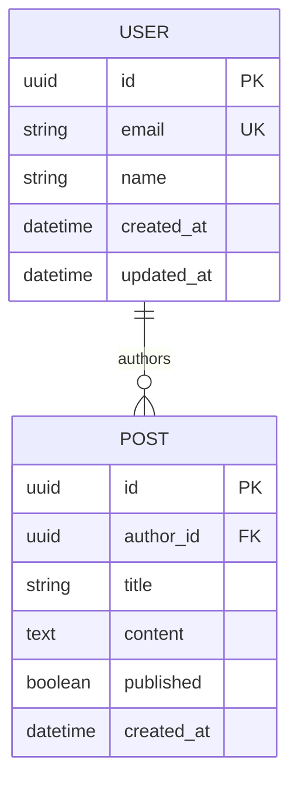

# ER Diagram Generator

Generate an entity-relationship diagram from database schema definitions in the project.

## Arguments

$ARGUMENTS - Optional schema source: `prisma`, `drizzle`, `sqlalchemy`, `django`, `typeorm`, `go-models`, `sql`, or `auto` (default). Specifies which ORM or schema format to read from.

## Instructions

You are generating an ER diagram from the project's database schema. Follow these steps precisely.

### Step 1: Detect Schema Source

If `$ARGUMENTS` is empty, `auto`, or not a recognized source, auto-detect by searching for:

| Source | Detection Signals |
|--------|-------------------|
| Prisma | `schema.prisma` file, `@prisma/client` in dependencies |
| Drizzle | `drizzle.config.ts`, `drizzle-orm` in dependencies, files with `pgTable`/`mysqlTable`/`sqliteTable` |
| SQLAlchemy | `Base = declarative_base()`, `class ... (Base):`, `mapped_column`, `__tablename__` |
| Django | `models.py` files with `models.Model` subclasses |
| TypeORM | `@Entity()` decorators, `typeorm` in dependencies |
| Sequelize | `sequelize.define`, `Model.init`, `sequelize` in dependencies |
| Go models | `gorm.Model` embeds, struct tags with `gorm:` |
| Raw SQL | `.sql` files with `CREATE TABLE` statements, migration files |
| Mongoose | `mongoose.Schema`, `mongoose.model` |
| Knex | `knex` migrations with `createTable` |

If multiple sources are found, prefer the primary ORM (the one with the most model definitions). Report which source was detected.

### Step 2: Extract All Entities

For each detected model/entity, extract:

1. **Entity name** (table name and model name if different)
2. **Fields** with:
   - Field name
   - Data type (normalize to generic types: `string`, `int`, `float`, `boolean`, `datetime`, `json`, `uuid`, `text`, `enum(values)`, etc.)
   - Constraints: `PK` (primary key), `FK` (foreign key → target), `UQ` (unique), `NN` (not null), `IDX` (indexed)
   - Default value if specified
3. **Relationships**:
   - One-to-One (`||--||`)
   - One-to-Many (`||--o{`)
   - Many-to-Many (`}o--o{`) — include the join table if explicit
4. **Indexes**: Composite indexes, unique indexes, partial indexes

### Step 3: Generate Mermaid ER Diagram

Generate a Mermaid `erDiagram` block with all entities, fields, and relationships.

Follow these conventions:
- List fields with their types inside each entity block
- Mark primary keys with `PK`
- Mark foreign keys with `FK`
- Mark unique fields with `UK`
- Use standard Mermaid ER relationship notation:
  - `||--||` : exactly one to exactly one
  - `||--o|` : exactly one to zero or one
  - `||--o{` : exactly one to zero or more
  - `||--|{` : exactly one to one or more
  - `}o--o{` : zero or more to zero or more
- Add relationship labels on the lines (e.g., `"has"`, `"belongs to"`, `"created by"`)

Example format:


Rules:
1. Include ALL entities — do not skip any models
2. Normalize type names for consistency across ORMs
3. Always show PK, FK, and UK markers
4. Label every relationship line
5. For many-to-many through a join table, show the join table as its own entity with FKs to both sides
6. Order entities logically — core/auth entities first, then domain entities, then supporting/lookup tables

### Step 4: Generate Entity Reference Table

After the diagram, produce a detailed reference table:

```markdown
## Entity Reference

### <EntityName> (`table_name`)
| Field | Type | Constraints | Default | Notes |
|-------|------|-------------|---------|-------|
| id | uuid | PK | gen_random_uuid() | |
| email | string(255) | UK, NN | | Indexed |
| ... | ... | ... | ... | ... |

**Relationships:**
- Has many `Post` via `Post.author_id`
- Belongs to `Organization` via `org_id`

**Indexes:**
- `idx_users_email` on `email` (unique)
- `idx_users_org_created` on `(org_id, created_at)` (composite)
```

Repeat for every entity.

### Step 5: Generate Relationship Summary

```markdown
## Relationship Summary

| From | To | Type | Via | Label |
|------|----|------|-----|-------|
| User | Post | 1:N | Post.author_id | "authors" |
| User | Team | M:N | TeamMember (join) | "member of" |
| ... | ... | ... | ... | ... |
```

### Step 6: Quality Warnings

Analyze the schema and report any of these issues:

- **Orphaned tables**: Tables with no relationships to any other table
- **Missing foreign key indexes**: FK columns without an index (causes slow JOINs)
- **Missing timestamps**: Tables without `created_at` / `updated_at` audit fields
- **Missing soft delete**: Tables that might benefit from `deleted_at` but lack it
- **Inconsistent naming**: Mixed naming conventions (camelCase vs snake_case, singular vs plural)
- **Wide tables**: Tables with more than 20 columns (consider normalization)
- **Missing unique constraints**: Fields that look like they should be unique (email, slug, username) but are not
- **Self-referencing relationships**: Flag these for visibility (e.g., `parent_id` on same table)
- **Circular dependencies**: Entity A references B which references A
- **Enum usage**: List all enum fields and their values for documentation

### Step 7: Output

Present in this order:
1. Schema source detected (and file locations)
2. Mermaid ER diagram in a fenced code block
3. Entity reference tables
4. Relationship summary table
5. Quality warnings (if any)

Do NOT save to a file unless the user explicitly asks. Output everything directly in the response.
